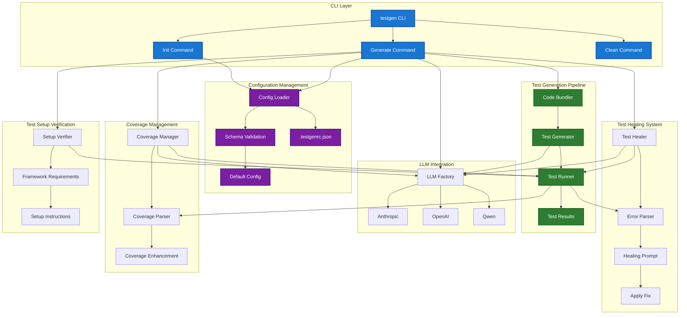

```mermaid
graph TB
subgraph CLI["CLI Layer"]
A[testgen CLI] --> B[Init Command]
A --> C[Generate Command]
A --> D[Clean Command]
end

    subgraph Config["Configuration Management"]
        E[Config Loader] --> F[Schema Validation]
        F --> G[Default Config]
        E --> H[.testgenrc.json]
    end

    subgraph TestGen["Test Generation Pipeline"]
        I[Code Bundler] --> J[Test Generator]
        J --> K[Test Runner]
        K --> L[Test Results]
    end

    subgraph LLM["LLM Integration"]
        M[LLM Factory] --> N[Anthropic]
        M --> O[OpenAI]
        M --> P[Qwen]
    end

    subgraph TestHealing["Test Healing System"]
        Q[Test Healer] --> R[Error Parser]
        R --> S[Healing Prompt]
        S --> T[Apply Fix]
    end

    subgraph Coverage["Coverage Management"]
        U[Coverage Manager] --> V[Coverage Parser]
        V --> W[Coverage Enhancement]
    end

    subgraph Setup["Test Setup Verification"]
        X[Setup Verifier] --> Y[Framework Requirements]
        Y --> Z[Setup Instructions]
    end

    %% Command Flow
    B --> E
    C --> E
    C --> X
    C --> I
    C --> M
    C --> Q
    C --> U

    %% Test Generation Flow
    J --> M
    K --> R
    K --> V

    %% Healing Flow
    Q --> M
    Q --> K

    %% Coverage Flow
    U --> M
    U --> K

    %% Setup Flow
    X --> K

    classDef primary fill:#1976d2,stroke:#0d47a1,stroke-width:2px,color:#fff
    classDef secondary fill:#7b1fa2,stroke:#4a148c,stroke-width:2px,color:#fff
    classDef tertiary fill:#2e7d32,stroke:#1b5e20,stroke-width:2px,color:#fff


    class A,B,C,D primary
    class E,F,G,H secondary
    class I,J,K,L tertiary
```
